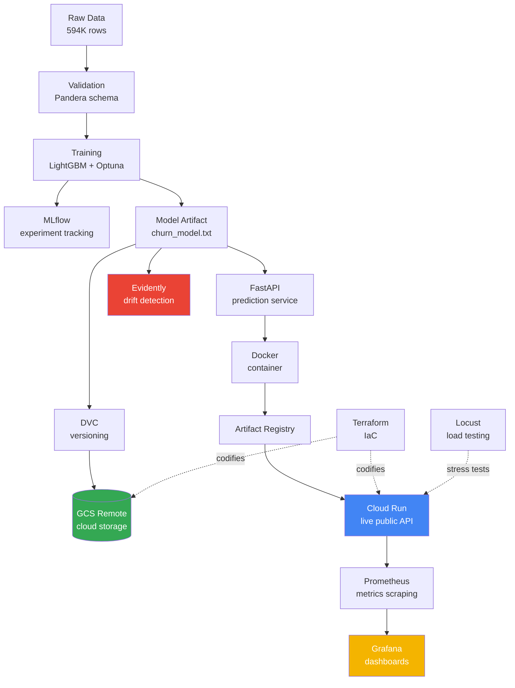

# Churn MLOps — Production-Grade ML Pipeline

End-to-end MLOps pipeline for telecom customer churn prediction. Built to production standards: reproducible training, automated quality checks, containerization, CI/CD, live cloud deployment, infrastructure-as-code, and full observability with metrics, dashboards, and drift detection.

> **🌐 LIVE DEMO:** https://churn-api-215271667398.asia-south1.run.app/docs
> Try the `/predict` endpoint in the interactive Swagger UI — the model is served from Google Cloud Run.

> **Status:** ✅ Complete — all 8 phases shipped (v2.0)

---

## 🎯 Project Goal

Predict which telecom customers will churn in the next 30 days, so retention teams can intervene early. The entire pipeline is treated as a production system: every component is reproducible, observable, and recoverable.

This project is the foundation of my **production ML reliability** specialization — the engineer who keeps AI systems alive at 3am.

---

## 🏗️ Architecture



**Pipeline flow:** Raw data is validated, used to train an Optuna-tuned LightGBM model tracked in MLflow, versioned with DVC (stored in GCS), served via a containerized FastAPI on Cloud Run (infrastructure codified in Terraform), and monitored end-to-end with Prometheus metrics, Grafana dashboards, Evidently drift detection, and Locust load testing.

---

## 🛠️ Tech Stack

### Foundation
- **Python 3.11.9** locked via `pyenv` + `.python-version`
- **pip-tools** for reproducible dependency locking
- **pre-commit** + **ruff** + **black** + **mypy** for automated code quality

### ML & Data
- **pandas** + **numpy** for data manipulation
- **Pandera** for schema validation
- **LightGBM** for gradient boosting
- **imbalanced-learn** for class imbalance (SMOTE)
- **Optuna** for hyperparameter tuning

### MLOps Stack
- **DVC** for data + model versioning
- **MLflow** for experiment tracking + model registry
- **FastAPI** + **Uvicorn** for model serving
- **Docker** + **docker-compose** for containerization
- **Prefect** for pipeline orchestration
- **GitHub Actions** for CI/CD

### Cloud & Infrastructure
- **GCP Cloud Run** for serverless deployment **(LIVE)**
- **GCP Cloud Build** + **Artifact Registry** for build + image storage
- **GCP Cloud Storage** as DVC remote
- **Terraform** for Infrastructure-as-Code

### Observability & Reliability
- **Prometheus** for metrics collection
- **Grafana** for live dashboards
- **Evidently** for data drift detection
- **Locust** for load testing

---

## 🚀 Quick Start

### Prerequisites
- macOS or Linux
- `pyenv` installed
- Python 3.11.9 available via pyenv
- Docker Desktop (for the containerized stack)
- Git

### Setup

```bash
# Clone the repo
git clone https://github.com/5Malav/churn-mlops.git
cd churn-mlops

# Set Python version + create virtualenv
pyenv local 3.11.9
python -m venv .venv
source .venv/bin/activate

# Install dependencies (pinned versions)
pip install pip-tools
pip-sync requirements.txt

# Install pre-commit hooks
pre-commit install

# Verify everything works
pre-commit run --all-files
```

---

## 📁 Project Structure

~~~
churn-mlops/
├── data/
│   ├── raw/          # Untouched original data (sacred, DVC-tracked)
│   ├── interim/      # Intermediate cleaning steps
│   ├── processed/    # Modeling-ready data
│   └── external/     # Third-party data
├── models/           # Trained model artifacts (DVC-tracked → GCS)
├── src/
│   └── churn_mlops/
│       ├── data/     # Data loading + validation
│       ├── features/ # Feature engineering
│       ├── models/   # Training + prediction
│       ├── api/      # FastAPI service (app + schemas + metrics)
│       ├── pipeline/ # Prefect orchestration flow
│       └── utils/    # Helpers + logging
├── tests/            # Pytest tests (incl. API tests + conftest)
├── terraform/        # Infrastructure-as-Code (GCS bucket + Cloud Run)
├── scripts/          # CLI scripts (incl. DVC stages + drift detection)
├── reports/          # Generated drift reports
├── notebooks/        # Jupyter exploration only
├── configs/          # Hydra YAML configs
├── .github/workflows/ # GitHub Actions CI pipeline
├── Dockerfile        # Container recipe (lean, runtime-only deps)
├── .dockerignore     # Keeps build context lean
├── docker-compose.yml # API + Prometheus + Grafana stack
├── prometheus.yml    # Prometheus scrape configuration
├── locustfile.py     # Load test definition
├── dvc.yaml          # DVC pipeline definition (validate → train)
├── dvc.lock          # Pinned hashes for reproducibility
├── pyproject.toml    # Single config for all dev tools
├── requirements.in   # Top-level dev dependencies
├── requirements.txt  # Locked dev dependency versions
├── requirements-api.in  # Lean runtime-only dependencies (for Docker)
└── requirements-api.txt # Locked runtime dependency versions
~~~

---

## 📊 Phase Progress — All Complete ✅

- [x] **Phase 0:** Foundation (pyenv, venv, Python 3.11.9)
- [x] **Phase 1:** Reproducible training
  - [x] Pre-commit hooks (ruff, black, ruff-format, end-of-file-fixer)
  - [x] Pandera schema validation (21 columns, happy + sad path tested)
  - [x] LightGBM training with SMOTE class balancing
  - [x] MLflow experiment tracking (params, metrics, model artifacts)
  - [x] Reproducibility verified (3 runs, identical metrics)
- [x] **Phase 2:** Hyperparameter tuning with Optuna
  - [x] Stratified subsampling for fast iteration (50K subset, 0.0003% class drift)
  - [x] Pluggable balancing strategies (SMOTE / class_weight / none)
  - [x] 30-trial Optuna study with TPE sampler, optimizing F1
  - [x] class_weight chosen over SMOTE: same F1, ~500x faster training
- [x] **Phase 3:** Data + model versioning with DVC
  - [x] DVC tracks 594K-row dataset (Git stores 93-byte pointers, not 80MB)
  - [x] DVC remote for offsite data + model storage
  - [x] Production model exported as versioned artifact (churn_model.txt)
  - [x] 2-stage reproducible pipeline (validate → train) via dvc.yaml
  - [x] `dvc repro` rebuilds the exact model; `dvc.lock` pins all hashes
- [x] **Phase 4:** Prediction API with FastAPI
  - [x] Prediction module (loads model, predicts one customer)
  - [x] Pydantic request/response validation (the input bouncer)
  - [x] FastAPI app: `/`, `/health`, `/predict` endpoints
  - [x] Graceful error handling (clean 500, no leaked tracebacks)
  - [x] 4 automated tests (health, predict, validation, error path)
- [x] **Phase 5:** Containerization with Docker
  - [x] Dockerfile with layer-cached builds (deps before code)
  - [x] Lean runtime-only image (816MB; dev/exploration tools excluded)
  - [x] Runtime deps pinned to training versions (no train/serve drift)
  - [x] System libs handled (libgomp1 for LightGBM)
  - [x] docker-compose for one-command orchestration + auto-restart
- [x] **Phase 6:** Pipeline automation with Prefect + CI/CD
  - [x] GitHub Actions CI: ruff lint + black format + pytest on every push
  - [x] Parallel CI job builds the Docker image from scratch
  - [x] Lazy model loading + test fixture so CI runs without the DVC model
  - [x] Prefect flow orchestrates validate → train as tracked tasks
  - [x] Automatic retries on task failure (self-healing pipeline)
- [x] **Phase 7:** Cloud deployment + Infrastructure-as-Code **(LIVE)**
  - [x] Containerized API deployed to Cloud Run (serverless, scales to zero)
  - [x] Cloud Build builds the image; Artifact Registry stores it
  - [x] Public HTTPS endpoint in asia-south1 (Mumbai)
  - [x] Resolved first-deploy IAM (service account storage + build roles)
  - [x] DVC remote migrated to Google Cloud Storage (dvc-gs backend)
  - [x] Infrastructure codified with Terraform (bucket + Cloud Run + IAM)
- [x] **Phase 8:** Monitoring + drift detection + load testing
  - [x] Prometheus metrics exposed by the API (RED: rate, errors, duration)
  - [x] Prometheus scraping via docker-compose
  - [x] Grafana dashboard visualizing request rate + latency
  - [x] Evidently data drift detection with statistical tests + HTML report
  - [x] Locust load testing with real throughput measurement

---

## 🎯 Model Performance — Optuna-Tuned on Real Data

The training pipeline is end-to-end functional, **Optuna-tuned**, on the full 594K-row Telco dataset.

```bash
# Run the full training pipeline
python -m src.churn_mlops.models.train
```

**Metrics (594K training rows, Optuna-tuned hyperparameters, class_weight balancing):**

| Metric    | Value  | Interpretation |
|-----------|--------|----------------|
| Accuracy  | 0.8296 | 83% of all predictions correct |
| Precision | 0.5837 | When model predicts "churn", 58% are real churners |
| Recall    | 0.8487 | Model catches **85%** of actual churners ⭐ |
| F1 Score  | 0.6917 | Balanced metric of precision + recall |
| ROC AUC   | 0.9143 | Strong ranking ability across 118K test samples |

**Tuning methodology:** 30-trial Optuna study on a stratified 50K subsample, optimizing F1 with TPE sampler. Winning hyperparameters (learning_rate=0.0101, num_leaves=169, min_child_samples=63, feature_fraction=0.5665, bagging_fraction=0.6944) were applied to the full dataset. class_weight balancing (instead of SMOTE) + Optuna-tuned params delivered both higher accuracy AND ~500x faster training (~11 sec vs ~92 min).

**View experiments in MLflow:**

```bash
mlflow ui --backend-store-uri file:./mlruns
# Open http://localhost:5000
```

---

## 🌐 Prediction API (Phase 4)

The trained model is served as a REST API with FastAPI.

```bash
# Start the API server locally
uvicorn src.churn_mlops.api.app:app --reload
# Open interactive docs: http://localhost:8000/docs
```

**Endpoints:**

| Method | Path | Purpose |
|--------|------|---------|
| GET | `/` | Welcome message |
| GET | `/health` | Health check (for monitoring) |
| POST | `/predict` | Send a customer → get churn probability + prediction |
| GET | `/metrics` | Prometheus metrics (request count, latency, status codes) |

### 🧪 Try It Yourself

The API is live — you can hit it right now. The easiest way is the interactive Swagger UI at **[/docs](https://churn-api-215271667398.asia-south1.run.app/docs)** (click `POST /predict` → "Try it out" → paste a sample below → Execute). Or use `curl` from your terminal.

> **Note:** the first request may take a few seconds — Cloud Run scales to zero when idle, so it "cold starts" the container. After that it's fast (~11ms of compute per prediction).

**Sample 1 — high-churn customer** (short tenure, month-to-month contract, fiber, electronic check):

```json
{
  "gender": "Female", "SeniorCitizen": 0, "Partner": "No", "Dependents": "No",
  "tenure": 2, "PhoneService": "Yes", "MultipleLines": "No",
  "InternetService": "Fiber optic", "OnlineSecurity": "No", "OnlineBackup": "No",
  "DeviceProtection": "No", "TechSupport": "No", "StreamingTV": "No",
  "StreamingMovies": "No", "Contract": "Month-to-month", "PaperlessBilling": "Yes",
  "PaymentMethod": "Electronic check", "MonthlyCharges": 70.70, "TotalCharges": 151.65
}
```
→ Returns a **high** churn probability (`churn_prediction: 1`).

**Sample 2 — low-churn customer** (long tenure, two-year contract, full add-ons, auto-pay):

```json
{
  "gender": "Male", "SeniorCitizen": 0, "Partner": "Yes", "Dependents": "Yes",
  "tenure": 68, "PhoneService": "Yes", "MultipleLines": "Yes",
  "InternetService": "DSL", "OnlineSecurity": "Yes", "OnlineBackup": "Yes",
  "DeviceProtection": "Yes", "TechSupport": "Yes", "StreamingTV": "Yes",
  "StreamingMovies": "Yes", "Contract": "Two year", "PaperlessBilling": "No",
  "PaymentMethod": "Bank transfer (automatic)", "MonthlyCharges": 85.25, "TotalCharges": 5800.00
}
```
→ Returns a **low** churn probability (`churn_prediction: 0`).

**With curl** (using Sample 1):

```bash
curl -X POST https://churn-api-215271667398.asia-south1.run.app/predict \
  -H "Content-Type: application/json" \
  -d '{"gender":"Female","SeniorCitizen":0,"Partner":"No","Dependents":"No","tenure":2,"PhoneService":"Yes","MultipleLines":"No","InternetService":"Fiber optic","OnlineSecurity":"No","OnlineBackup":"No","DeviceProtection":"No","TechSupport":"No","StreamingTV":"No","StreamingMovies":"No","Contract":"Month-to-month","PaperlessBilling":"Yes","PaymentMethod":"Electronic check","MonthlyCharges":70.70,"TotalCharges":151.65}'
```

**Response:**

```json
{"churn_probability": 0.7508, "churn_prediction": 1}
```

Input is validated with Pydantic (malformed requests get a clean 422 error). Internal failures return a clean 500 without leaking tracebacks. Run the API tests with `pytest tests/test_api.py -v`.

---

## 🐳 Running with Docker (Phase 5)

The API is fully containerized for portable, reproducible deployment.

```bash
# Build and run the full stack (API + Prometheus + Grafana)
docker compose up

# Or run just the API manually
docker build -t churn-api:latest .
docker run -p 8000:8000 churn-api:latest
# API live at http://localhost:8000/docs
```

**Container design notes:**
- **Lean image (816MB):** production image installs only runtime dependencies (`requirements-api.txt`) — dev/exploration tools excluded for a smaller, faster, more secure image.
- **No train/serve drift:** runtime dependencies (pandas, numpy, lightgbm) are pinned to the exact versions used during training.
- **System libraries:** `libgomp1` is installed for LightGBM's OpenMP runtime.
- **Layer caching:** dependencies are installed before code is copied, so code changes trigger fast rebuilds.

---

## 🤖 CI/CD & Orchestration (Phase 6)

### Continuous Integration (GitHub Actions)

Every push to `main` triggers an automated pipeline (`.github/workflows/ci.yml`) with two parallel jobs:

- **test job:** lints with ruff, checks formatting with black, runs the full pytest suite
- **docker job:** builds the production Docker image from scratch to catch any Dockerfile breakage

Because the model is DVC-tracked (absent on the CI runner), both jobs generate a lightweight stand-in model so the full pipeline runs anywhere. The app uses **lazy model loading** — the module imports cleanly without the model file present, which makes it testable in CI.

### Pipeline Orchestration (Prefect)

The training pipeline is wrapped as a Prefect flow (`src/churn_mlops/pipeline/flow.py`):

- **Tasks:** `validate_data` → `train_model`, each tracked with its own state
- **Automatic retries:** each task retries up to 2 times with a delay on failure — the pipeline self-heals from transient errors

---

## ☁️ Cloud Deployment + Infrastructure-as-Code (Phase 7)

The containerized API is deployed live on **Google Cloud Run** — serverless, auto-scaling, scale-to-zero.

**🌐 Live:** https://churn-api-215271667398.asia-south1.run.app/docs

```bash
# Deploy from source (builds in the cloud, pushes, and deploys — one command)
gcloud run deploy churn-api \
  --source . --region asia-south1 \
  --allow-unauthenticated --memory 1Gi --port 8000
```

**Deployment design notes:**
- **Serverless + scale-to-zero:** Cloud Run runs the container on demand and scales to zero when idle, so a portfolio deployment costs effectively nothing.
- **Cloud-native build:** `--source .` uses Cloud Build to build the image and Artifact Registry to store it.
- **IAM:** first deploy required granting the Cloud Build service account `storage.objectViewer` + `cloudbuild.builds.builder` roles.

### DVC Remote on Cloud Storage

The DVC remote was migrated from a local folder to a **Google Cloud Storage** bucket (`dvc-gs` backend), so the versioned model + data live in the cloud and are reachable from any machine.

> Python libraries (like DVC's GCS backend) authenticate via Application Default Credentials — `gcloud auth application-default login` — which is separate from the `gcloud` CLI login.

### Infrastructure-as-Code (Terraform)

The cloud infrastructure — the GCS bucket, the Cloud Run service, and public-access IAM — is defined as code in `terraform/main.tf`. Existing resources were adopted with `terraform import`, so the code manages live infrastructure without recreating it.

```bash
cd terraform
terraform init      # download the Google provider
terraform plan      # preview changes (read before applying)
terraform apply     # reconcile infrastructure to match the code
```

State files (`*.tfstate`) and the provider cache (`.terraform/`) are gitignored; only the source (`main.tf`) and provider lock file are committed.

---

## 📈 Monitoring & Observability (Phase 8)

The heart of production ML reliability — knowing whether the system (and the model) is healthy.

### Metrics + Dashboards (Prometheus + Grafana)

The full observability stack runs together via docker-compose:

```bash
docker compose up
# API:        http://localhost:8000/docs
# Prometheus: http://localhost:9090
# Grafana:    http://localhost:3000  (admin / admin)
```

- The API exposes Prometheus metrics at `/metrics` via `prometheus-fastapi-instrumentator` — automatically tracking the **RED method**: request **R**ate, **E**rror rate, and request **D**uration (latency), broken down by endpoint and status code.
- **Prometheus** scrapes `/metrics` every 15 seconds and stores the time-series history (`prometheus.yml`).
- **Grafana** connects to Prometheus as a data source and visualizes request rate and latency in a live dashboard (PromQL: `rate(http_requests_total[1m])`).

### Data Drift Detection (Evidently)

Models degrade silently when live data diverges from training data. `scripts/detect_drift.py` uses **Evidently** to catch it:

```bash
python -m scripts.detect_drift
# Generates reports/drift_report.html
```

- Compares a **reference** dataset (training baseline) against a **current** dataset (new data), per feature.
- Uses the appropriate statistical test per feature type — **Wasserstein distance** for numeric features, **Jensen-Shannon distance** for categorical.
- Produces a visual HTML report flagging which features drifted, with drift scores and distribution plots, at both feature and dataset level.
- Demonstrated by simulating drift (shifting `tenure` and `MonthlyCharges`) — Evidently correctly flagged exactly the shifted features while leaving the other 17 stable.

### Load Testing (Locust)

`locustfile.py` defines a load test that simulates concurrent users hitting `/predict` and `/health`:

```bash
# With the stack running (docker compose up), in a second terminal:
locust -f locustfile.py --host http://localhost:8000
# Open http://localhost:8089 to configure users + ramp, then Start
```

**Results:**

| Concurrent Users | Requests/sec | Median Latency | 95th %ile | 99th %ile | Failures |
|------------------|--------------|----------------|-----------|-----------|----------|
| 50               | 24           | 10 ms          | 24 ms     | 39 ms     | 0        |
| 200              | 55           | 16 ms          | 73 ms     | 120 ms    | 0        |
| 500              | 81           | 49 ms          | 1600 ms   | 1800 ms   | 0        |

> Load tested locally against the single containerized API instance, ramping from 50 to 500 concurrent users. The API handled **50–200 users with sub-100ms p95 latency and zero failures**. At **500 users the saturation point emerged** — throughput capped around **~80 requests/second** and p95 latency rose to ~1.6s as requests queued, but critically **zero requests failed** — the service degraded gracefully (slower responses) rather than dropping or erroring requests. This identifies a single-instance ceiling of ~80 req/s; beyond that, the path to scale is horizontal (additional Cloud Run instances behind the built-in load balancer) rather than vertical.

---

## 🔍 Known Limitations & Future Enhancements

This is a portfolio project built to demonstrate production MLOps patterns end-to-end. A few corners were deliberately scoped out — documenting them explicitly, since knowing a system's boundaries is part of engineering it responsibly:

- **Unseen categorical handling:** The API validates *types* via Pydantic, but does not yet reject categorical *values* the model never saw during training (e.g. a `Contract` value of `"Biennial"`). Such an input currently passes through to the model rather than returning a clean `422`. Adding an allowed-values check per categorical field is the next reliability hardening step — the goal being an explicit error over a silent, unreliable prediction.
- **No alerting yet:** Prometheus collects the metrics and Grafana visualizes them, but there are no alerting rules (e.g. Alertmanager firing on error-rate or latency thresholds). The metrics that *would* drive alerts already exist; wiring notification routing is the logical next layer.
- **Authentication:** The live endpoint is intentionally `--allow-unauthenticated` so the demo is publicly testable. A production deployment would put it behind authentication (API keys or IAM-based invoker permissions).
- **Continuous deployment:** CI runs lint, tests, and a Docker build on every push, but deployment to Cloud Run is currently manual (`gcloud run deploy`). A full CD step (e.g. deploy-on-merge via Cloud Deploy or a GitHub Actions job) would close the loop.
- **CI uses a stand-in model:** CI generates a lightweight dummy model rather than pulling the real one from GCS, so the pipeline runs anywhere without credentials. Wiring CI to `dvc pull` the real model is a documented future step.

### Rollback Runbook

Because deployments are versioned, recovering from a bad release is fast:

- **Cloud Run** keeps every deployed revision. Rolling back is a traffic switch to the last-known-good revision — no rebuild required:
  ```bash
  # List revisions, then route 100% of traffic back to a known-good one
  gcloud run revisions list --service churn-api --region asia-south1
  gcloud run services update-traffic churn-api --region asia-south1 --to-revisions <REVISION>=100
  ```
- **The container image** is pinned by digest in Terraform, so infrastructure can be reconciled to a known image with `terraform apply`.
- **Data and models** are DVC-versioned in GCS, so any prior model artifact can be restored with `dvc checkout` against an earlier commit.

---

## 🔄 Reproducing This Project

```bash
# 1. Clone the repo
git clone https://github.com/5Malav/churn-mlops.git
cd churn-mlops

# 2. Set up environment
pip-sync requirements.txt

# 3. Pull DVC-tracked data and model from the GCS remote
dvc pull

# 4. Reproduce the entire pipeline (validate → train)
dvc repro
```

The `dvc.lock` file pins exact hashes of all dependencies and outputs, so `dvc repro` produces a bit-for-bit identical model.

---

## 📊 Version History

| Version | Date | Milestone | Key Achievement |
|---------|------|-----------|-----------------|
| v1.0 | May 2026 | Sample data | Pipeline correctness verified end-to-end |
| v1.1 | May 2026 | Full data | Real-data baseline: ROC AUC 0.91, Recall 0.85 |
| v1.2 | May 2026 | Optuna-tuned | Tuned model: F1 0.69, ROC AUC 0.91, 500x faster |
| v1.3 | May 2026 | DVC pipeline | Full data + model versioning, reproducible `dvc repro` |
| v1.4 | May 2026 | REST API | FastAPI: /predict, /health, validated input, graceful errors |
| v1.5 | May 2026 | Docker | Containerized: lean 816MB image, compose, pinned deps |
| v1.6 | June 2026 | CI/CD | GitHub Actions (lint/test/build) + Prefect orchestration |
| v1.7 | July 2026 | Cloud | Live on GCP Cloud Run: public HTTPS, serverless, scale-to-zero |
| v1.8 | July 2026 | Cloud + IaC | DVC remote on GCS + infrastructure codified in Terraform |
| **v2.0** | **July 2026** | **Monitoring** | **Full observability: Prometheus + Grafana + Evidently drift + Locust load testing. Project complete.** |

---

## 👤 Author

**Malav Joshi**
Ahmedabad, India · [GitHub](https://github.com/5Malav)

Building toward production ML reliability — the engineer who keeps AI systems alive.

---

## 📜 License

MIT
